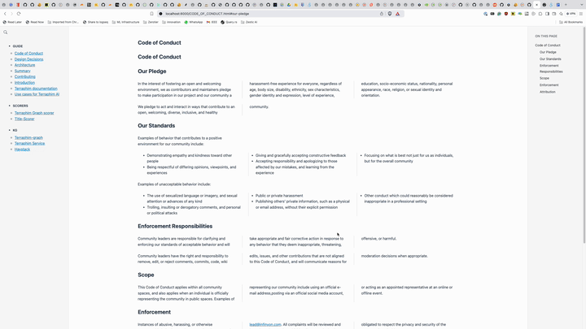

# MD book is a mdbook replacement with extra features to make docs beautiful
## Features
* parse md, mdx or gfm files thanks to markdown-rs
* tera templates for easy hacking
* Beautiful default styling
* Right hand TOC to navigate around the page.
* Create index.md to create a content for home page, alternatively it will create a list of cards with all the pages as index.
* Code blocks with syntax highlighting on server side using syntect

## Run
Checkout the source code and run:

```rust
cargo run -- -i ../mdBook/test_book  -o ./test_mdbook
```

-i is the input directory and -o is the output directory.
input directory is the directory with md files.

input directory with markdown files and the tool will generate the output directory with the html files ready to be deployed on any static site. 

Adjust the styling in the src/templates/css/styles.css file.

Or anything you want to change in the src/templates folder, it's a standard tera template so you can add your own custom stuff there.


# Screenshots




# Configuration

You can add a book.toml file to the input directory to configure the book.

Supports TOML configuration via book.toml
Allows overriding with environment variables (prefixed with MDBOOK_)
Supports command line arguments
Enables shell expansion in config file paths
Provides default values for optional fields
Example usage:

```bash
# Using environment variables
MDBOOK_BOOK.TITLE="My Book" ./md-book -i input -o output

# Using custom config file
./md-book -i input -o output -c ~/my-config.toml

# Config values can be nested using underscore
MDBOOK_OUTPUT.HTML.MATHJAX_SUPPORT=true ./md-book -i input -o output
```
The configuration system follows the priority order:
1. Command line arguments (highest priority)
2. Environment variables (prefixed with MDBOOK_)
3. Custom config file (if provided)
4. Default book.toml
5. Default values (lowest priority)
you shall be able to feed config into json and yaml files.

# Serve and Watch

## Just build
```bash
cargo run -- -i input -o output
```

## Build and watch
```bash
cargo run -- -i input -o output --watch
```

## Build and serve
```bash
cargo run -- -i input -o output --serve
```

## Build, watch and serve on custom port
```bash
cargo run -- -i input -o output --watch --serve --port 8080
```

# TODO
[ ] Rust specific synax highlight
[ ] Search
[ ] Mathjax