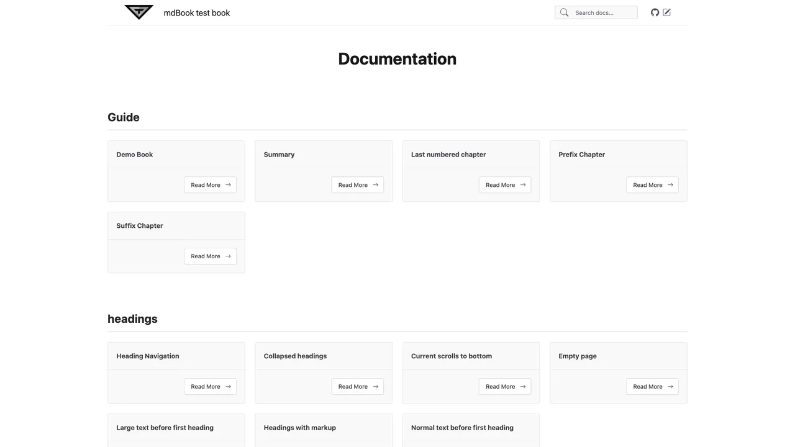

# 🦀 MD-Book

[](https://github.com/terraphim/md-book/actions)
[](https://opensource.org/licenses/MIT)
[](https://github.com/terraphim/md-book/actions)
[](https://codecov.io/gh/terraphim/md-book)

> **A modern mdBook replacement written in Rust that generates beautiful HTML documentation from Markdown files**

MD-Book is the next-generation documentation generator for Rust projects. Built with performance and developer experience in mind, it combines the simplicity of mdBook with modern web capabilities.
## ✨ Features

### 🚀 **Modern Markdown Processing**
- **Multi-format support**: Parse standard Markdown, GitHub Flavored Markdown (GFM), and MDX files
- **Powered by markdown-rs**: Fast and reliable parsing with extensive feature support

### 🎨 **Beautiful Documentation**
- **Responsive design**: Desktop to mobile optimized layouts
- **Card-based navigation**: Intuitive homepage with visual page cards
- **Right-hand TOC**: In-page table of contents for easy navigation
- **Modern styling**: Clean, professional appearance out of the box

### ⚡ **Developer Experience**
- **Live development server**: Watch files and reload automatically
- **Syntax highlighting**: Server-side code highlighting with syntect
- **Full-text search**: Integrated Pagefind search with instant results
- **Flexible templates**: Tera templating engine for easy customization

### 🔧 **Production Ready**
- **Static site generation**: Deploy anywhere (Netlify, Vercel, Cloudflare Pages)
- **Fast builds**: Optimized Rust performance for large documentation sets
- **Feature flags**: Include only what you need (server, search, syntax highlighting)
- **WASM support**: Compile to WebAssembly for browser-based usage

## 🚀 Quick Start

### Installation
```bash
cargo install md-book
```

### Basic Usage
```bash
# Build documentation
md-book -i docs -o output

# Development mode with live reload
md-book -i docs -o output --serve --watch

# Custom port
md-book -i docs -o output --serve --port 8080
```

### From Source
```bash
git clone https://github.com/terraphim/md-book.git
cd md-book
cargo run -- -i docs -o output
```

**-i** = input directory (contains your .md files)  
**-o** = output directory (generated HTML ready for deployment)

The tool generates static HTML files that can be deployed to any static hosting service.

### Customization
- **Styling**: Edit `src/templates/css/styles.css`
- **Templates**: Modify files in `src/templates/` (standard Tera templates)
- **Configuration**: Add `book.toml` for advanced settings

## Styling

* Nicer default styling for content - multiple columns for horizontal layout,
* Right-hand TOC to navigate around the page.
* Create index.md to create content for the home page; alternatively, it will create a list of cards with all the pages as an index.


- Code blocks with syntax highlighting

- Better default styling

## 🆚 Why MD-Book?

| Feature | MD-Book | mdBook | Docusaurus | VitePress |
|---------|---------|--------|------------|-----------|
| **Language** | 🦀 Rust | 🦀 Rust | ⚛️ Node.js | ⚛️ Node.js |
| **Performance** | ⚡ Blazing fast | ⚡ Fast | 🐢 Slower | ⚡ Fast |
| **Build Time** | < 1s (small) | < 2s (small) | 10-30s | 5-15s |
| **Bundle Size** | ~50KB | ~100KB | ~500KB | ~200KB |
| **Search** | ✅ Pagefind | ❌ Basic | ✅ Algolia | ✅ Built-in |
| **Live Reload** | ✅ WebSocket | ✅ Basic | ✅ Fast Refresh | ✅ HMR |
| **MDX Support** | ✅ Native | ❌ Limited | ✅ Full | ✅ Full |
| **Themes** | ✅ Customizable | ✅ Basic | ✅ Extensible | ✅ Vue-based |
| **Deployment** | ✅ Anywhere | ✅ Anywhere | ✅ Optimized | ✅ Optimized |

### 🎯 **Choose MD-Book if you want:**
- **Rust-native performance** with minimal dependencies
- **Simple setup** without complex configuration
- **Modern features** like search and live reload
- **Static deployment** to any hosting platform
- **Clean, fast documentation** that just works

### 📦 **Perfect for:**
- **API documentation** for Rust libraries
- **Project READMEs** and guides
- **Technical blogs** and tutorials
- **Internal documentation** with search
- **Open source projects** needing fast docs

## Responsive Layout
Desktop to mobile responsive design with card-based navigation.


## Code & Navigation
Syntax highlighting, page navigation, and content browsing.


## Search
Full-text search powered by Pagefind with instant results.



# Development

## Quick Start

1. **Clone and build:**
   ```bash
   git clone https://github.com/terraphim/md-book.git
   cd md-book
   cargo build
   ```

2. **Set up pre-commit hooks (recommended):**
   ```bash
   make install-pre-commit
   # or manually:
   ./scripts/setup-pre-commit.sh
   ```

3. **Run quality checks:**
   ```bash
   make qa              # Run all checks (format, lint, test)
   make dev-check       # Complete development check
   make ci-local        # Simulate CI checks locally
   ```

## Available Commands

- `make help` - Show all available commands
- `make check` - Run cargo check
- `make fmt` - Check code formatting
- `make fmt-fix` - Fix code formatting
- `make clippy` - Run clippy lints
- `make test` - Run unit tests
- `make test-integration` - Run integration tests
- `make test-all` - Run all tests
- `make qa` - Run all quality checks
- `make clean` - Clean build artifacts

## Pre-commit Hooks

The project includes pre-commit hooks that automatically run:
- `cargo fmt --all -- --check` - Formatting check
- `cargo clippy --all-targets --all-features -- -D warnings` - Linting
- `cargo test --lib --bins` - Unit tests
- `cargo check --all-targets --all-features` - Compilation check

These run automatically on every commit to ensure code quality.

# Configuration

You can add a book.toml file to the input directory to configure the book.

Supports TOML configuration via book.toml
Allows overriding with environment variables (prefixed with MDBOOK_)
Supports command-line arguments
Enables shell expansion in config file paths
Provides default values for optional fields
Example usage:

```bash
# Using environment variables
MDBOOK_BOOK.TITLE="My Book" ./md-book -i input -o output

# Using custom config file
./md-book -i input -o output -c ~/my-config.toml

# Config values can be nested using an underscore
MDBOOK_OUTPUT.HTML.MATHJAX_SUPPORT=true ./md-book -i input -o output
```
The configuration system follows the priority order:
1. Command line arguments (highest priority)
2. Environment variables (prefixed with MDBOOK_)
3. Custom config file (if provided)
4. Default book.toml
5. Default values (lowest priority)
you shall be able to feed config into json and yaml files.

# Serve and Watch

## Just build
```bash
cargo run -- -i input -o output
```

## Build and watch
```bash
cargo run -- -i input -o output --watch
```

## Build and serve
```bash
cargo run -- -i input -o output --serve
```

## Build, watch and serve on custom port
```bash
cargo run -- -i input -o output --watch --serve --port 8080
```

## Deployment

MD-Book supports deployment to multiple platforms:

### Cloudflare Pages (Recommended)
```bash
# Setup (includes 1Password integration)
./scripts/setup-cloudflare.sh

# Deploy to production  
./scripts/deploy.sh production
```

### Netlify
```bash
# Build site
cargo run -- -i docs -o dist

# Deploy with CLI
netlify deploy --prod --dir=dist

# Or drag & drop at https://app.netlify.com/drop
```

See [DEPLOYMENT.md](DEPLOYMENT.md) for comprehensive deployment documentation including:
- 1Password integration for secure secret management
- GitHub Actions workflows
- Custom domains and SSL
- Performance optimization
- Platform comparison

# Security Considerations

## HTML in Markdown

By default, raw HTML in markdown files is **disabled** for security. If you enable `allow_html` in your configuration:

```toml
[output.html]
allow-html = true
```

**Warning:** This allows arbitrary HTML/JavaScript in your markdown files to be rendered. Only enable this if:
- You trust all content authors
- Your documentation is not user-generated
- You understand the XSS (Cross-Site Scripting) implications

The default `allow-html = false` setting is safe and recommended for most use cases.

## 🤝 Community

### Contributing
We welcome contributions! See [CONTRIBUTE.md](CONTRIBUTE.html) for guidelines.

- 🐛 **Bug Reports**: [Open an issue](https://github.com/terraphim/md-book/issues)
- 💡 **Feature Requests**: [Start a discussion](https://github.com/terraphim/md-book/discussions)
- 🔧 **Pull Requests**: Always welcome!

### Good First Issues
- [ ] Rust-specific syntax highlighting
- [ ] MathJax/LaTeX support
- [ ] Dark mode theme
- [ ] Internationalization (i18n)

### Support
- 📖 [Documentation](https://github.com/terraphim/md-book/wiki)
- 💬 [Discussions](https://github.com/terraphim/md-book/discussions)
- 🐦 [Twitter](https://twitter.com/terraphim)

---

## 📊 Roadmap

### v0.2.0 (Next)
- [ ] Enhanced theme system
- [ ] Plugin architecture
- [ ] Multi-language support
- [ ] Advanced search filters

### v0.3.0 (Future)
- [ ] Visual editor
- [ ] Collaboration features
- [ ] Analytics integration
- [ ] API documentation mode

---

## 📄 License

Licensed under the [MIT License](LICENSE).

---

## 🙏 Acknowledgments

- Built with [markdown-rs](https://github.com/raphlinus/pulldown-cmark) for parsing
- Styled with [Tera](https://tera.netlify.app/) templating engine
- Search powered by [Pagefind](https://pagefind.app/)
- Inspired by [mdBook](https://github.com/rust-lang/mdBook)

---

**⭐ Star this repo if MD-Book helps you create better documentation!**
